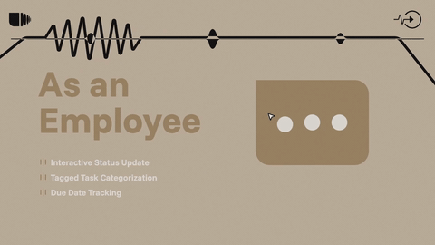
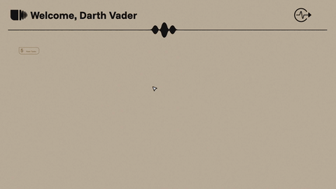
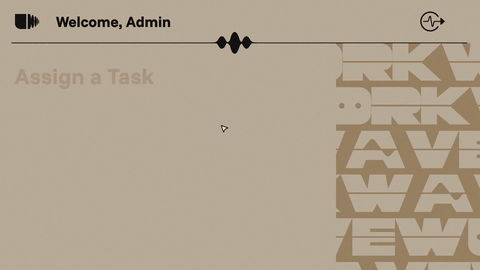

# 🌊 WorkWave — Employee Management System

WorkWave is a **modern Employee Management System (EMS)** built with **React** and powered by **Local Storage**.  
It enables **admins** to create and manage tasks, and **employees** to view and track them — all with a clean UI and smooth experience.

---

## ✨ Features

- 🔑 **Role-based access**: Admins vs Employees  
- 📝 **Task Management**: Create, edit, and assign tasks  
- 💾 **Local Storage Powered**: No external database required  
- 🎨 **Responsive UI**: Built with modern React concepts  
- ⚡ **Fast & Lightweight**: Runs directly in the browser  

---

## 📸 Screenshots & Demo

### 🔹 Landing Page View

### 🔹 Employee View

### 🔹 Admin Task Creation

---

## 🛠️ Tech Stack

- **Frontend**: React (Hooks + Context API)  
- **Storage**: Local Storage (Object-based task saving)  
- **Styling**: CSS / Tailwind
- **Animation**: GSAP

---

## 📽️Full Walkthrough of site

https://www.linkedin.com/posts/malay-shikhar-soni_react-webdevelopment-employeemanagement-activity-7309255883161485313-RlNv?utm_source=social_share_send&utm_medium=member_desktop_web&rcm=ACoAAEaQa5IBiDQKmiAgLSjzVA97n1sl7GOSobk

---

## ▶️ Deployed Website

https://workwave-six.vercel.app/

---
