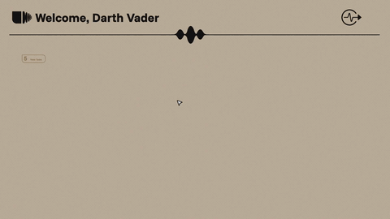
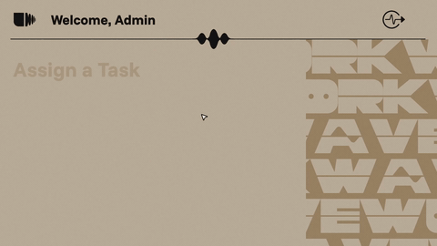

# 🌊 WorkWave — Employee Management System

WorkWave is a modern full-stack Employee Management System (EMS).

It enables:

- Admins to build teams, invite employees, and assign/manage tasks
- Employees to accept team invitations, manage assigned tasks, and track task status

The current version uses a React frontend, Express backend, and PostgreSQL database.

---

## ✨ Core Features

- 🔐 Role-based authentication (`admin` and `employee`)
- 👥 Team invitation workflow
	- Admin sends invitations
	- Employee accepts/rejects invitations
	- Employee can belong to only one accepted team
- 📝 Team-scoped task management
	- Admin can assign tasks only to accepted team members
	- Employee can accept, complete, or fail tasks
- 📊 Admin task overview grouped by team member
- 🎨 Rich, animated UI with GSAP + Tailwind CSS
- 🌐 API-driven architecture with PostgreSQL persistence

---

## 📸 Screenshots & Demo

### Landing Page View


### Employee View


### Admin Task Creation


---

## 🏗️ Architecture

- Frontend: React (Vite) + Context API + Axios
- Backend: Node.js + Express REST API
- Database: PostgreSQL (Neon-compatible configuration)
- Auth: JWT access and refresh tokens

---

## 🛠️ Tech Stack

### Frontend

- React 18
- React Router DOM
- Axios
- Tailwind CSS
- GSAP

### Backend

- Node.js
- Express
- pg (PostgreSQL driver)
- bcryptjs
- jsonwebtoken
- helmet
- cors
- express-rate-limit

### Deployment

- Frontend: Vercel
- Backend: Render-ready setup
- Database: Neon-ready setup

---

## 🚀 Quick Start (Local Development)

## 1. Prerequisites

- Node.js 18+
- npm
- PostgreSQL database (local or Neon)

## 2. Clone & Install

```bash
git clone <your-repo-url>
cd ems

cd backend
npm install

cd ../frontend
npm install
```

## 3. Configure Backend Environment

Create a file at `backend/.env`:

```env
PORT=5000
DATABASE_URL=postgresql://<user>:<password>@<host>/<database>?sslmode=require
JWT_SECRET=your_access_token_secret
JWT_REFRESH_SECRET=your_refresh_token_secret
```

Notes:

- `backend/src/config/database.js` already uses `DATABASE_URL` with SSL settings for managed PostgreSQL.
- For local PostgreSQL, you can still use a connection string format in `DATABASE_URL`.

## 4. Database Schema

Ensure your database has these tables:

- `users`
- `tasks`
- `refresh_tokens`
- `team_invitations`

You can run the invitations migration script to create `team_invitations`:

```bash
cd backend
node src/config/migration.js
```

## 5. Configure Frontend Environment

Create `frontend/.env`:

```env
VITE_API_URL=http://localhost:5000/api
```

## 6. Run the App

Backend:

```bash
cd backend
npm run dev
```

Frontend:

```bash
cd frontend
npm run dev
```

Open the frontend URL shown by Vite (typically `http://localhost:5173`).

---

## 🔌 API Modules (Current)

### Auth

- `POST /api/auth/register`
- `POST /api/auth/login`
- `GET /api/auth/me`
- `GET /api/auth/employees` (admin, accepted team members only)

### Tasks

- `POST /api/tasks` (admin)
- `GET /api/tasks/all` (admin)
- `GET /api/tasks/by-employee` (admin)
- `DELETE /api/tasks/:taskId` (admin)
- `GET /api/tasks/my-tasks` (employee)
- `GET /api/tasks/my-task-counts` (employee)
- `PUT /api/tasks/:taskId/accept` (employee)
- `PUT /api/tasks/:taskId/complete` (employee)
- `PUT /api/tasks/:taskId/fail` (employee)

### Invitations

- `POST /api/invitations/send` (admin)
- `GET /api/invitations/team` (admin)
- `GET /api/invitations/available-employees` (admin)
- `GET /api/invitations/pending` (admin)
- `GET /api/invitations/my-invitations` (employee)
- `PUT /api/invitations/respond/:id` (employee)

---

## 📽️ Full Walkthrough

https://www.linkedin.com/posts/malay-shikhar-soni_react-webdevelopment-employeemanagement-activity-7309255883161485313-RlNv?utm_source=social_share_send&utm_medium=member_desktop_web&rcm=ACoAAEaQa5IBiDQKmiAgLSjzVA97n1sl7GOSobk

---

## ▶️ Live Frontend

https://workwave-six.vercel.app/

---
